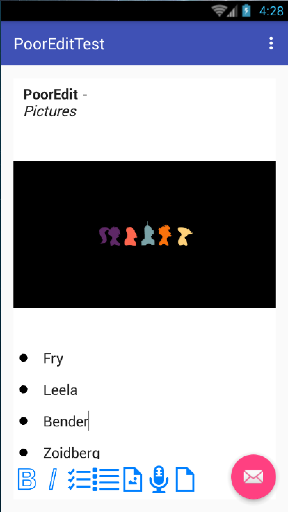

#PoorEdit

[](https://android-arsenal.com/details/1/2870)

Rich Text Editor for Android

#Status
WIP. So those who forked this repo may need to merge my code manually.

Buggy but almost there!

#Screenshots
I'm tring to make it look & feel like you are still in `Evernote`


<br />


#Features
* Basic text editing
* Bold
* Italic
* Underline
* Highlight
* Images
* File attachments
* Todo lists
* Lists
* JSON export
* JSON import

#Usage
##Setup
This project is still working in progress and I do NOT recommend using it in production env.

After check out this repo, you will get a test project and `PoorEdit` widget is located in `pooredit` folder. Import this folder as module in Android Studio.

Put below code in your layout xml file.

```xml
<sun.bob.pooredit.PoorEdit
    android:layout_width="match_parent"
    android:layout_height="match_parent"
    android:id="@+id/id_poor_edit"/>
```

And in the Activity which contains this widget, you may need to override `onActivityResult` function as below.

```java
@Override
protected void onActivityResult(int requestCode, int resultCode, Intent data){
    poorEdit.onActivityResult(requestCode, resultCode, data);
    //Write your code below.
}
```

The reason for that is `PoorEdit` need to start image picking or file picking activities and it will require picking result after those activities finished.

That's all you need to do to initialize a shinny tinny rich editor.

##Export & Import
PoorEdit support `json` export and import.

You can take the sample project as reference or use below two functions.

```java
PoorEdit.exportJSON(String jsonFolder)
PoorEdit.loadJson(String jsonFolder)
```

Both functions require an string arguement which is the folder where the json file will be. 

PoorEdit will create a `content.json` in that folder. The reason why we need a folder is, I think you may want to copy files, images and other stuff in editor to one folder. That's make the folder a `notebook`, which you can upload those files to a webserver or something. Notice, PoorEdit dose NOT contains the upload part. It  even doesn't require an Internet permission.

Below is the complete import & export code in sample project.

```java
@Override
    public boolean onOptionsItemSelected(MenuItem item) {
        int id = item.getItemId();
        //Do the export.
        if (id == R.id.action_exp) {
            ((PoorEdit) findViewById(R.id.id_poor_edit)).exportJSON("/sdcard/pooredit/debug/");
            return true;
        }
        //Do the import.
        if (id == R.id.action_imp){
            ((PoorEdit) findViewById(R.id.id_poor_edit)).loadJson("/sdcard/pooredit/debug/");
        }

        return super.onOptionsItemSelected(item);
    }
```

When you click those menu items, a json file located in `/sdcard/pooredit/debug/content.json` will be created / loaded.

#Todos
* UI tweaks.
* Bug fix.
* Add voices.
* Add handwritings
* Font & Colors

#Why
To be honest I always thinking about writing a rich text editor on Android. 

There are lots of brilliant projects on GitHub.

But still, I wondering whether I can do it or not.

So here we are.

I take `Evernote`'s edit widget as a reference. 

I didn't use webview in this widget. 

All code are written in pure Java.

And I have to say to writing a complex widget like that is so hard for just one guy.

So,

###ANY PULL REQUSTS IS WELCOME!
###THANKS IN ADVANCE!

#Credits
Icons from [icons8.com](https://icons8.com/)

#License

###Good Boy License

Please do whatever your mom would approve of.